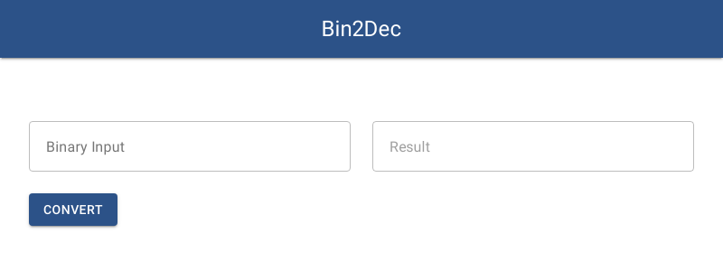

# Binary to Decimal Converter

A simple app to convert binary to decimal made with [.NET 5](https://dotnet.microsoft.com/), [Blazor](https://dotnet.microsoft.com/apps/aspnet/web-apps/blazor) and [MudBlazor](https://mudblazor.com/)

## Installation

Use the [dotnet cli](https://dotnet.microsoft.com/download/dotnet/5.0) to install Bin2Dec.

```bash
dotnet restore
dotnet run
```
## Preview



## Contributing
Pull requests are welcome.

## License
[MIT](https://raw.githubusercontent.com/mkarvalho/bin2dec/main/LICENSE)